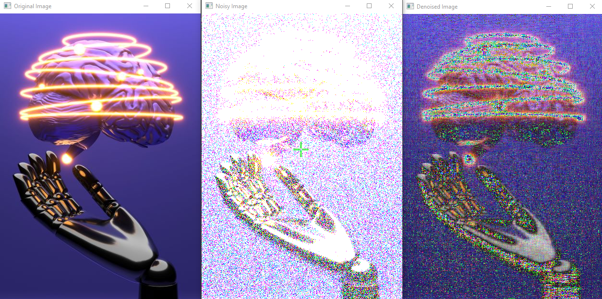

# SVD

In this project, the Singular Value Decomposition (SVD) algorithm has been used to remove noise from images. In this algorithm, the amateur image is considered as a matrix. Then, using SVD, the larger singular values are kept in the left and right matrices, and the other values are replaced with zero. In fact, this algorithm decomposes the amateur image into sets of smaller images. In this set, there are smaller images with higher quality, which can be combined to produce a noise-free image.

Various initiatives have been taken to implement the SVD algorithm on images in this project. In particular, the "add_noise" function has been used to add Gaussian noise to the image, and the "svd" function has been used to decompose the singular values of the image. Also, the "denoise_image" function has been implemented to remove noise from the image.

The number given to the "denoise_image" function as input represents the number of singular values that remain in the image after noise removal. A larger number means keeping more singular values, which will result in a higher quality image but at the same time will preserve more noise. A smaller number means keeping fewer singular values, which will result in a lower quality image but at the same time will remove more noise.

